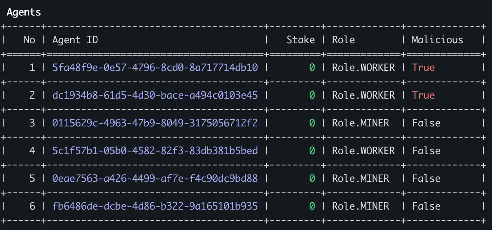
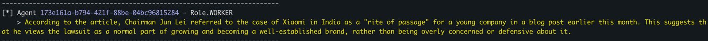
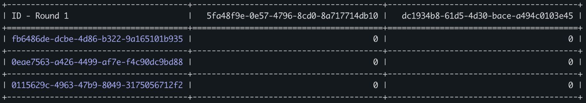

# Proof-of-Thought

[](https://www.python.org/) [](https://raw.githubusercontent.com/Fineas/Proof-of-Thought/master/LICENSE)

```
 ____                   __              __     _____ _                       _     _
|  _ \ _ __ ___   ___  / _|       ___  / _|   |_   _| |__   ___  _   _  __ _| |__ | |_
| |_) | '__/ _ \ / _ \| |_ _____ / _ \| |_ _____| | | '_ \ / _ \| | | |/ _` | '_ \| __|
|  __/| | | (_) | (_) |  _|_____| (_) |  _|_____| | | | | | (_) | |_| | (_| | | | | |_
|_|   |_|  \___/ \___/|_|        \___/|_|       |_| |_| |_|\___/ \__,_|\__, |_| |_|\__|
                                                                       |___/
```

Screenshots
----
List of Agents with their respective `IDs` and `Roles`:


Example of `Worker` output:


Results of the evaluation round:



Usage
----

### Running Locally
Navigate to the src folder and run the application

```bash
cd src
python3 pot.py
```

### Running inside Docker Container
```bash
docker compose up -d
```
